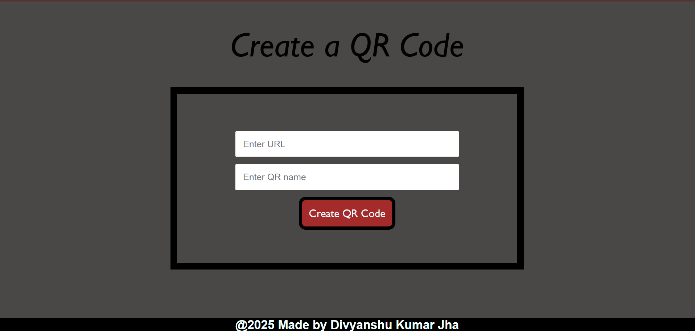

# QR Code Generator

A clean and lightweight **QR Code Generator** web application that allows users to generate, preview, and download QR codes for any URL instantly.

This project is built with a focus on **core web fundamentals, correct backend–frontend interaction, and a professional UI**, making it suitable for portfolios, internships, and technical interviews.

---

## 📸 UI Preview



---

## ✨ Features

* Generate QR codes for any valid URL
* Instant QR preview on the page
* Automatic QR code download (PNG)
* Stateless backend (no file storage)
* Clean, modern, responsive UI
* Reliable browser-safe download using Blob URLs

---

## 🛠 Tech Stack

### Frontend

* HTML5
* CSS3 (Flexbox, modern layout, gradients)
* Vanilla JavaScript (Fetch API, Blob handling)

### Backend

* Node.js
* Express.js
* `qr-image` (QR code generation library)

---

## ⚙️ How It Works

1. The user enters a URL and an optional QR name.
2. The frontend sends the URL to the backend using the Fetch API.
3. The backend generates a QR code and streams it directly as a PNG response.
4. The frontend:

   * Displays the QR code preview
   * Automatically downloads the QR image using a Blob-based approach

This design avoids server-side file storage and scales cleanly.

---

## 🚀 Getting Started

### 1. Clone the repository

```bash
git clone https://github.com/Divyanshu227/QRProject.git
cd qr-code-generator
```

### 2. Install dependencies

```bash
npm install
```

### 3. Start the server

```bash
node index.js
```

### 4. Open in browser

```text
http://localhost:3000
```

---

## 📂 Project Structure

```text
├──node_modules 
├── public/
│   ├── index.html
│   ├── style.css
│   └── main.js
├── .gitignore
├── index.js
├── package.json
├── package-lock.json
├── page.png
└── readme.md
```

---

## ✅ Key Design Decisions

* **No server-side file saving** — improves security and scalability
* **Streaming QR generation** — faster and memory efficient
* **Blob-based downloads** — reliable across modern browsers
* **Framework-free frontend** — demonstrates strong fundamentals

---

## 🔧 Possible Enhancements

* SVG download support
* Toggle for auto-download
* Additional QR types (text, WiFi, vCard)
* Loading indicators
* Dark mode

---

**QR Code Generator** — built using modern web fundamentals.
